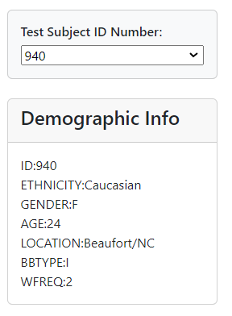
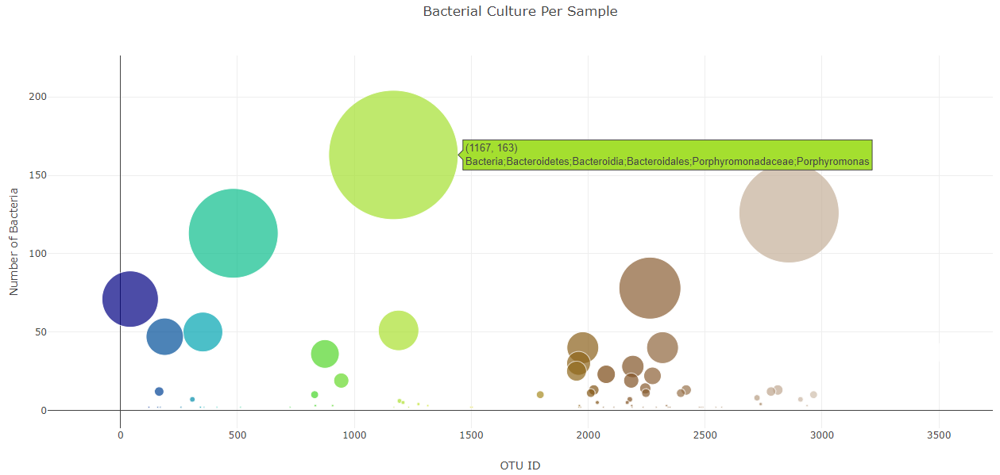
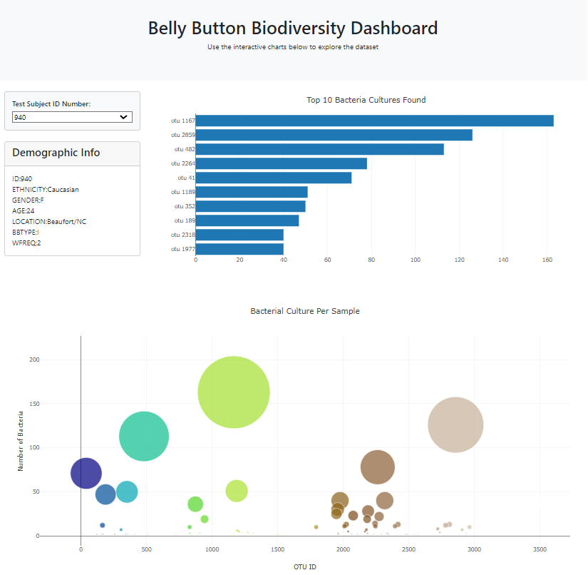

# belly-button-challenge
Background

In this project, an interactive dashboard was built to explore the Belly Button Biodiversity which catalogs the microbes that colonize human navels.
Link: http://127.0.0.1:3002/index.html

The dataset reveals that a small handful of microbial species (also called operational taxonomic units, or OTUs, in the study) were present in more than 70% of people, while the rest were relatively rare.

Table of Contents

1. Create a metadata panel displaying an individual's demographic information

2. Create a bubble chart that displys each sample

3. Create a horizontal bar chart with a dropdown manu to display the top 10 OTUs found in that individual

Introduction of the Belly Button Biodiversity dashboard

Figure 1. Metadata panel correspodning to a dropdown manu shown as below

A matadata panel display demographic information was created by looping through each key-value pair from the metadata JSON object and create a text string and appending an html tag with that text to the #sample-metadata panel.

Figure 2. Horizontal bar chart correspodning to a dropdown manu shown as below

Using the D3 library to read in samples.json from the URL https://static.bc-edx.com/data/dl-1-2/m14/lms/starter/samples.json, a horizontal bar chart with a dropdown menu was created to display the top 10 OTUs found in that individual.

Figure 3. Bubble chart correspodning to a dropdown manu shown as below

Figure 4. Layout of the dashbord 

